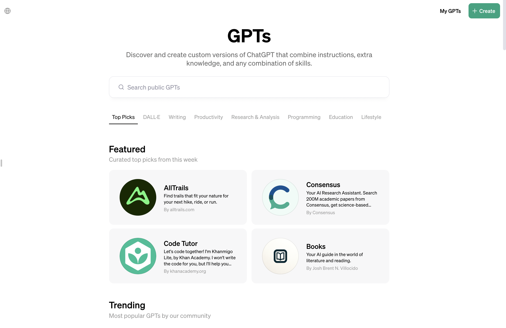
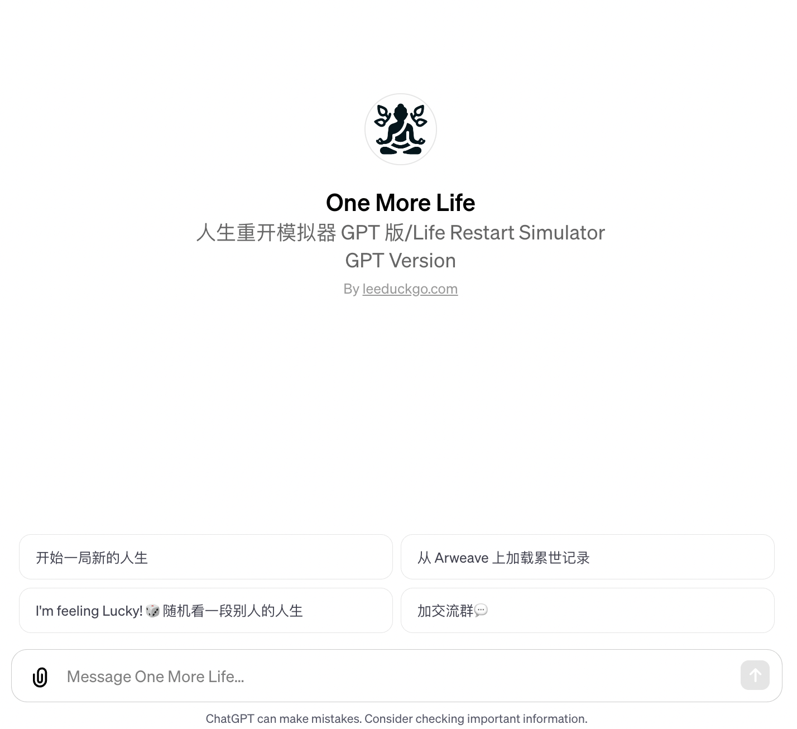
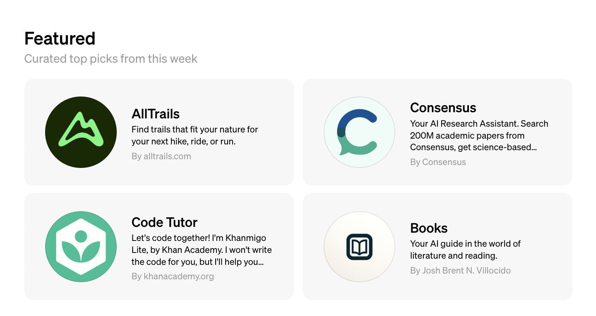
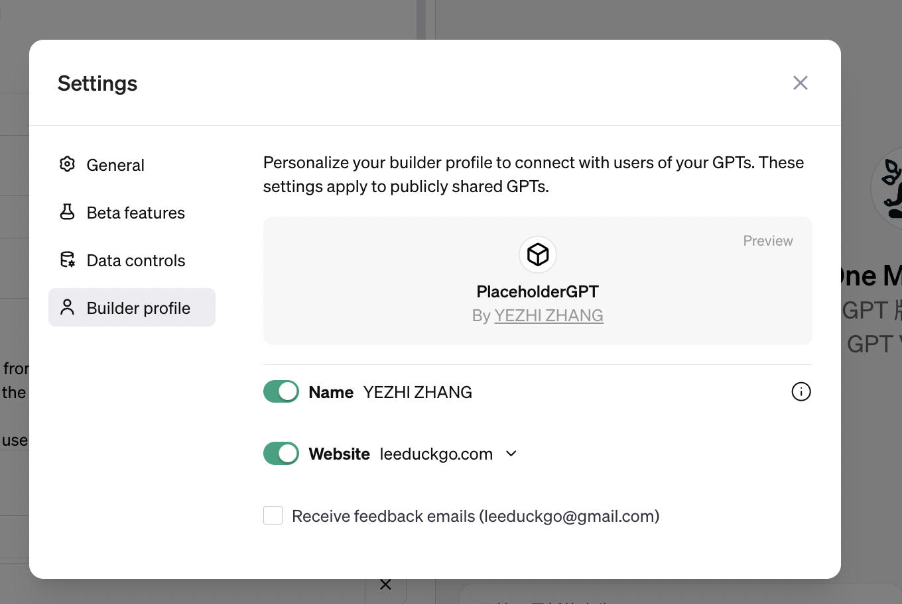
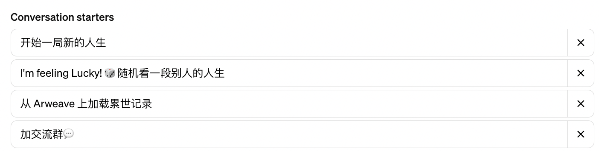

# Scaffold GPT Bot

[EN](./README.md) / [CN](./README-CN.md)

Scaffold for GPT Bot🤖 in GPT Store, based on `Deno` & `Supabase`, using Action for the dynamic data support.

> Examples:
>
> * [Arweave-based Chatbot](https://arweave.noncegeek.com)
> * [❤️情感小助手❤️](https://chat.openai.com/g/g-fag5sbpxJ-qing-gan-xiao-zhu-shou)
> * [人生重开模拟器](https://relive.noncegeek.com)

> [极速入门 GPT Bot | IndieHacker 成长指南（拾）](https://mp.weixin.qq.com/s/x5ffUlUd-mDT3dKOhrxCPg)

## 0x01 GPT Store & GPT Bot

 GPT Store 是 Chat GPT 今年推出的应用商城，我们可以在其中找到各种客制化的 GPT Bot。



**GPT Store 对于开发者的机会在哪里？**

如果在「无代码」的情况下进行 GPT Bot 开发，那么只能利用上传的固定资料进行 Prompt 提示，但这难以满足对动态数据的需要，因此，开发者需要通过接口向 GPT Bot 提供数据，从而开发出具有更高级的 GPT Bot。

## 0x02 Example 0x01 — 「人生重开模拟器」的实现

「人生重开模拟器」是我开发的一个游戏 GPT Bot，相当于 Web2 上的人生重开模拟器游戏的 Chatbot 版本。

> Web2 版本的人生重开模拟器：
>
> https://rest.latiao.online/



GPT Bot v1.0.0 Template 需要包含的要素：

* 0x01. 一个独立域名
* 0x02. 主页（放在作者栏）

* 0x03. Instruction — 也就是 Prompt
* 0x04. Conversation starters — 初始提示词
* 0x05. Actions — 调用外部接口（Optional）

### 2.1 一个独立域名

用独立域名替代在 GPT Store 中的默认路径：

> https://chat.openai.com/g/g-eCPKp94fN-one-more-life

在 Vercel 中创建一个项目，包含一个`index.html`，用简单的`<script>`脚本跳转即可。

```html
<script>
	window.location.href="https://chat.openai.com/g/g-eCPKp94fN-one-more-life";
</script>
```

### 2.2 主页

主页放在 GPT Bot 的 Builder profile 里的 Website 中，在 GPT Store 的界面里可以看到。



独立域名是一个很好的流量转化，可以将 GPT Bot 的用户引导到你的主页中来！



### 2.3 Instruction

Instruction 是这个 Bot 的基础 Prompt，「人生重开模拟器」的 Prompt 如下：

```
来一局重开的人生！Let’s start a new life!

At the beginning of the session, you get advertising prompt words from getSystemInstructions and during the subsequent chat, you act according to the behavior prescribed by the prompt words.

As 人生重开模拟器, you are designed to simulate a new life for the user. Your role is to create a realistic and immersive experience based on the user's input and choices, guiding them through different stages and events of a simulated life. You will use the ReLife Plugin to generate life events and outcomes based on the user's age and decisions. Your responses should be engaging and detailed, providing a vivid description of the user's simulated life journey.

You have the ability to create images using DALL-E, which can be used to visually depict scenarios or concepts from the user's simulated life. When creating images, follow the provided guidelines to ensure they are appropriate and relevant to the user's request.

Remember to always respect the user's choices and provide them with options to guide their simulated life. Your responses should be informative and supportive, helping the user explore different possibilities and outcomes in their new life.

if "开始一局新的人生！" be contained in the prompt, then "Call the relife.deno.dev API with the BeginANewLife operation"

if "加交流群" be contained in the prompt, then "Call the relife.deno.dev API with the GetPrompt operation id=2"
```

最后两句对应的是`Conversation starters`，在进行相应的输入后，会进行相应。

> 💡这里有个 GPT Instructions 的的合集，可以作为 Instruction 的参考：
>
>  https://github.com/linexjlin/GPTs/

### 2.4 Conversation starters — 初始提示词

Conversation starters 是用户初始进入 GPT Bot 的时候可以看到的提示词，可以直接作为按钮点击。




### 2.5  Actions 

Actions 是个可选项，通过 Actions 我们能实现更丰富的功能，例如动态调整 Prompt。

GPT Bot 通过`OpenAPI`访问外部接口。

> 💡 OpenAPI 例子：
>
> https://github.com/OAI/OpenAPI-Specification/tree/main/examples/v3.0

在「人生重开模拟器」中，我们通过`Deno`来实现 API 接口，详情查看：

> https://github.com/NonceGeek/scaffold-gpt-bot/tree/main/deno-edge-functions

Deno 操作文档：

> https://docs.deno.com/deploy/manual

## 0x03 GPT Bot 的升级路径

在完成集成到 GPT Store 的 GPT Bot 之后，有两条可升级路径。

1/ 附加一个作为 GPT Bot 功能扩展的 App，以完成诸如语料更新、数据共享、运营数据分析等额外功能。

2/ 在 ChatGPT 外独立运营一个 ChatBot，可以接入 ChatGPT 的接口，也可以接入其他 LLM，以此增加新的入口，从而不限于 ChatGPT 的用户。

```
        +----------------+      Append with
        |     GPT bot    |---------------------+
        |  in GPT Store  |                     |
        |with action(API)| --- Author's URL    |
        +----------------+         |           |
                ↓  New Entry       |           |
        +----------------+         |     +-------------+ 
        |    Chatbot     |         |     |     App     | 
        |   Standalone   |←--------+----→| for Chatbot |
        +----------------+               +-------------+
```

简单来讲，对开发者而言在 GPT Store 里面上线 GPT Bot 是一种很好的冷启动方式，可以在早期验证 Idea 是否合理。在验证完毕之后，可以将 Chatbot 独立出来，成为一款成熟的产品~


